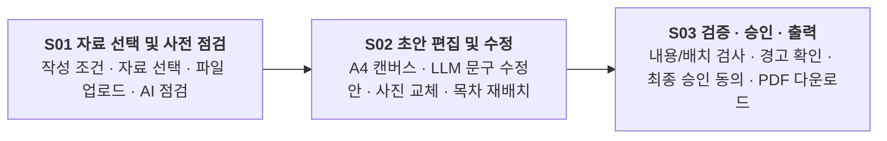

# agent-ddalgi-frontend 개발 작업 내역 종합 보고서

> 2026-09-30 후속: 자동 스탠드얼론/가짜 성공 표시를 해제했다. 아래 과거 오프라인 기능 설명은 현재 서비스 연결 상태를 뜻하지 않는다. 최신 변경과 검증은 문서 마지막 기록을 따른다.

- **작성일자**: 2026-09-30
- **프로젝트**: 회사소개서 초안 생성 AI 어시스턴트 프론트엔드 (`agent-ddalgi-frontend`)
- **저장소 위치**: `agent-ddalgi-frontend-develop`
- **적용 규격**: 백엔드 루트 `contracts.md` v1.11 / 계약 1.5
- **기술 스택**: React 19, TypeScript, Vite 8, TailwindCSS v4, React Router Dom 7, Lucide React, html2canvas, jsPDF, docx, file-saver

---

## 1. 프로젝트 개요

본 프로젝트는 기업용 회사소개서 자동 생성 AI 파이프라인의 프론트엔드 시스템입니다. 사용자가 제공하는 회사 기본 정보 및 각종 원천 자료(문서, 발표자료, 이미지 등)를 기반으로 AI가 사전 점검을 수행하고, 초안 문서를 생성하며, 텍스트 및 사진 후보를 사용자가 직접 비교·편집한 후, 엄격한 내용 검증(Fact Checking)을 거쳐 인쇄 품질의 고해상도 PDF로 최종 승인·다운로드할 수 있는 3단계 엔터프라이즈 위저드 워크플로우를 제공합니다.



---

## 2. 작업 타임라인 및 마일스톤

### 1단계: 초기 세팅 및 마이그레이션 & 기초 검증 (2026-09-18 이전 ~ 09-18)
- **React + TS + Vite 초기 세팅 (`0aa130b`)**: 최신 React 19와 TypeScript, Vite 환경 구축.
- **기존 프론트엔드 마이그레이션 (`a0bc035`, PR #1)**: 이전 레거시 구조에서 신규 아키텍처로 컴포넌트 및 타입 정의 이관.
- **Mock 데이터 렌더링 13/13 검증 (`4a795cc`, PR #2)**:
  - `fixtures/mock_job_ready.json` 및 `mock_job_error.json` 기반 SSR 렌더링 검사 스크립트(`docs/검증스크립트/render_check.tsx`) 구축.
  - 14개 항목 라벨, 4가지 상태 배지, 본문 13개 섹션 순서/내용, 11개 확인 질문, 출처/인용문 일치 완벽 검증.
- **폴링·다운로드 네트워크 격리 검토**:
  - 중복 클릭 방지, 지수 백오프 폴링, 오류 응답 파일 저장 차단 등 안정성 코드 추적 및 잠재 위험 분석.
- **문서화**: `docs/B_프론트엔드_작업기록_0918.md`, `docs/B_프론트엔드_일일요약_0918.md`, `docs/B_프론트엔드_검증기록_0918.md` 작성.

### 2단계: 3단계 엔터프라이즈 위저드 & 고해상도 PDF 출력 구현 (2026-09-28, PR #4, PR #5)
- **3-Step Wizard 인터페이스 확립 (`a1f7205`)**:
  - 상단 고정 글로벌 헤더(56px), 진행 단계 인디케이터(`StepIndicator`), 상태 알림 모달(`SystemStatusModal`) 구현.
- **안정적인 PDF 출력 파이프라인 구축 (`75ae9ee`, `b781368`, `40d4008`)**:
  - 브라우저 네이티브 PDF 다운로드 연동 및 한글 폰트 렌더링 깨짐 방지 (`canvas-to-pdf`).
  - 고해상도 이미지 및 캡션 임베딩 지원.
- **목차(TOC) 및 에디터 인터랙션 고도화 (`fc0f7f8`, `f8f5e71`, `eafb30d`)**:
  - 목차 드래그 앤 드롭 및 원클릭 순서 재배치 구현.
  - 목차 선택 시 중앙 A4 캔버스와 우측 AI 사이드카 동적 연동.
  - 승인 화면의 카드 그리드 뷰 및 단일 페이지 뷰 모드 지원.

### 3단계: 화면설계도 v1.0 적용 & 백엔드 실제 계약(contracts 1.5) 연동 (2026-09-29, PR #6)
백엔드 계약 v1.11 / 계약 1.5에 맞추어 실제 API를 전면 연동하고 화면설계도를 반영하였습니다.

- **S01 자료 선택·사전 점검 연동**:
  - `src/api/sources.ts`, `src/hooks/useSources.ts`, `SourceSelectionView.tsx`.
  - 작성 조건 설정(회사명, 독자, 목적, 분량), 자료 카드 선택(시연/실제 자료 구분).
  - 파일 업로드 지원(TXT, MD, PDF, DOCX, PPTX, JPG, PNG / 파일당 10MB, 세션당 최대 10개).
  - AI 사전 점검 연동 (`PrecheckPanel.tsx`): 사실·근거 구간·보완 사항·추천 분량 표시 및 확인 체크 게이트.
- **S02 초안 편집 & LLM 문구 수정안(`proposals`) 연동**:
  - `src/api/publication.ts`, `src/hooks/usePublication.ts`, `DocumentWorkspace.tsx`.
  - 선택한 텍스트 블록 1개에 대해 `POST /documents/{did}/proposals` 호출.
  - 원문 vs AI 제안 vs 추천 이유 비교 패널(`AiSidecar.tsx`) 제공 ➔ 명시적 `적용(Apply)` 또는 `거부(Reject)`.
  - 빈 페이지 정리 기능: 내용이 없는 빈 페이지만 안전하게 삭제(`delete_page`).
- **S03 승인 및 고해상도 PDF 출력 연동**:
  - `ApprovalExportView.tsx`.
  - 실제 PDF 배치 검사 이미지 미리보기, 내용 검증(Content Review) 결과 표시.
  - Blocker(필수 결함) 수정 강제 및 Warning(권고 경고) 사유 입력 확인.
  - 명시적 최종 승인 동의 후 고해상도 PDF 다운로드 (동일 바이트 재다운로드 보장).

### 4단계: 에디터 레이아웃 개선, 사진 후보 기능 고도화 & 충돌 해결 (2026-09-29 ~ 09-30, PR #8, Merge)
- **사진 후보 편집 및 검증 (`e598d6b`)**:
  - 텍스트 블록 뒤 사진 추가 / 기존 사진 교체 후보(`candidates`) 조회 및 선택 적용.
  - 새 사진 캡션(설명) 필수 입력 및 이미지 무결성 검증.
  - 완료된 사진 후보 창 닫기 및 문서 레이아웃 시각적 튜닝.
- **브랜치 병합 (`cc733de`)**:
  - `develop` 브랜치 병합 중 `ApprovalExportView.tsx` 충돌 해결 완료.

---

## 3. 화면별 세부 기능 명세

| 화면 | 주요 컴포넌트 | 담당 기능 및 사용자 흐름 |
| :--- | :--- | :--- |
| **S01<br/>자료 선택 및<br/>사전 점검** | `SourceSelectionView.tsx`<br/>`SessionUploadPanel.tsx`<br/>`PrecheckPanel.tsx` | • **작성 설정**: 회사명, 독자, 목적, 강조 사항, 희망 페이지 수 설정<br/>• **자료 선택**: 등록 자료 및 시연 자료(`DEMO_MODE`) 다중 선택<br/>• **파일 업로드**: 다중 포맷 첨부, 멱등성 요청 키 재시도 복구<br/>• **AI 사전 점검**: 사실/근거 매핑, 보완점, 추천 분량 확인 후 초안 생성 요청 |
| **S02<br/>초안 편집 및<br/>문구/사진 수정** | `DocumentWorkspace.tsx`<br/>`DraftEditorView.tsx`<br/>`AiSidecar.tsx`<br/>`ParagraphEditor.tsx` | • **A4 캔버스 에디터**: 실제 출력 비율 캔버스, 줌 조절, 인라인 텍스트 편집<br/>• **목차(TOC)**: 페이지 순서 드래그 앤 드롭 재배치<br/>• **LLM 문구 제안**: 블록별 AI 문구 수정 요청 및 원문 대조 적용/거절<br/>• **사진 관리**: 텍스트 뒤 사진 추가, 사진 교체 후보 선택 및 캡션 입력<br/>• **빈 페이지 정리**: 내용 없는 페이지 원클릭 안전 삭제 |
| **S03<br/>최종 검증,<br/>승인 및 출력** | `DocumentWorkspace.tsx`<br/>`ApprovalExportView.tsx` | • **미리보기 모드**: 카드 그리드 뷰 및 단일 페이지 뷰 전환<br/>• **내용 검증(Content Review)**: AI 사실 검증 및 누락 조건 지적 확인<br/>• **경고 관리**: 필수 문제(Blocker) 차단, 권고 경고(Warning) 자연어 사유 입력 및 확인<br/>• **최종 승인 및 다운로드**: 모든 경고 확인 후 최종 승인 동의 및 고해상도 PDF 다운로드 |

---

## 4. 핵심 아키텍처 및 안전 설계 원칙

1. **상태 분리 및 브라우저 스토리지 최소화**:
   - `localStorage`에는 세션 ID, 작업 ID, 문서 버전, 요청 키 해시만 보관합니다.
   - **원문 문서, 업로드 사진, AI 생성 본문, 최종 승인 동의 정보는 브라우저 스토리지에 영구 저장하지 않습니다.** 새로고침 시 백엔드 API를 통해 서버 정본으로부터 안전하게 복원합니다.
2. **멱등성 및 네트워크 유실 복구**:
   - 업로드, AI 점검/초안 생성, 문구 수정안, 저장 요청 시 고유한 `request_key`를 발급합니다.
   - 네트워크 단절이나 응답 유실 시 동일한 키로 재시도하여 중복 결제 및 중복 생성을 원천 차단합니다.
3. **엄격한 승인 및 검증 게이트**:
   - 미저장 편집 내용이 존재하는 경우 최종 승인 및 PDF 출력이 엄격히 차단됩니다.
   - 본문 편집 및 저장 시 기존에 통과했던 내용 검증, PDF 배치 검사, 승인은 즉시 무효화되어 재검증을 요구합니다.
   - 필수 문제(Blocker)는 사용자가 사유를 입력하더라도 통과할 수 없습니다.

---

## 5. 자동화 검증 스크립트 및 시험 결과

- **`node scripts/check-sources.mjs`**:
  - 자료 선택, 파일 업로드/읽기, 멱등 재시도, 버전 충돌, 세션 복원 등 브라우저 E2E 검증 통과.
- **`node scripts/check-ai-workflow.mjs` (Mock 모드)**:
  - 14~19개 검사 묶음(선택 자료 후보, 응답 유실 복구, 추가/교체/설명 저장, 텍스트/버전 충돌, 실제 승인/PDF 동일 바이트 재다운로드) 전 항목 통과.
- **실제 LLM 유료 파이프라인 완주 (`--publication --proposal --review-replay`)**:
  - 프롬프트 전송 JSON 구조 최적화를 통해 10,000자 초과 방지 (11,306자 ➔ 9,653자 경량화).
  - 실제 LLM 점검 1회 + 초안 생성 1회 + 문구 수정안 1회 + 내용 검증 1회 ➔ 경고 확인 ➔ 고해상도 PDF 렌더링 ➔ 최종 다운로드 완주 확인 (한글 회사명, 납기 조건 등이 반영된 4쪽/2쪽 실제 PDF 산출 확인).

---

## 6. 주요 파일 및 디렉토리 구조

```
src/
├── App.tsx                     # 전역 헤더, 3단계 스텝 네비게이션, 상태 모니터
├── main.tsx                    # 애플리케이션 엔트리포인트
├── index.css                   # TailwindCSS v4 디자인 시스템 토큰
├── api/
│   ├── client.ts               # Axios 기본 인스턴스 (Same-Origin)
│   ├── sources.ts              # S01 자료 목록, 업로드, 선택 API
│   ├── aiWorkflow.ts           # S01 AI 사전 점검 및 초안 생성 작업 API
│   ├── publication.ts          # S02/S03 문서 저장, 수정안, 검증, 승인, PDF API
│   └── sessions.ts             # 세션 수명주기 및 상태 관리 API
├── components/session/
│   ├── StepIndicator.tsx       # 상단 3단계 위저드 진행 표시줄
│   ├── SourceSelectionView.tsx # [S01] 자료 선택 및 작성 조건 화면
│   ├── PrecheckPanel.tsx       # [S01] AI 사전 점검 및 추천 분량 패널
│   ├── SessionUploadPanel.tsx  # [S01] 다중 파일 첨부 패널
│   ├── DocumentWorkspace.tsx   # [S02/S03] 워크스페이스 컨테이너 (화면 전환/상태 보존)
│   ├── DraftEditorView.tsx     # [S02] A4 캔버스 에디터 & 목차(TOC) 트리
│   ├── AiSidecar.tsx           # [S02] AI 문구 수정안 대조/적용 & 원문 근거 패널
│   ├── ParagraphEditor.tsx     # [S02] 인라인 블록 텍스트 에디터
│   ├── ApprovalExportView.tsx  # [S03] 최종 내용 검증, 경고 확인, 승인 및 PDF 출력
│   ├── DocumentExportBar.tsx   # [S03] 하단 액션 독 (승인 / 다운로드)
│   └── SystemStatusModal.tsx   # 예외 상태 및 시스템 모니터링 팝업
docs/
├── 프론트엔드_작업내역_종합정리.md # (상세 보고서) 전체 작업 히스토리 및 명세
├── B_프론트엔드_작업기록_0918.md
├── B_프론트엔드_일일요약_0918.md
└── B_프론트엔드_검증기록_0918.md
scripts/
├── check-sources.mjs           # S01 자료 선택 브라우저 자동화 검증
└── check-ai-workflow.mjs       # S02/S03 워크플로우 및 PDF E2E 검증
```


## 2026-09-30 후속: 자동 가짜 데이터 표시 해제

- 요청: 실제 거산 자료와 서버 등록 시연 자료로 실행하며 프론트 가짜 자료 6개의 자동 표시를 해제한다.
- 유입: `e48663b`(오프라인 스탠드얼론 지원), PR #11의 병합 `cfcd779`(2026-09-30 16:19 KST). 최초 방문에 저장 세션이 없어도 fallback 세션/자료를 만들던 경로였다.
- 변경: `useSources`·`useAiWorkflow`·`usePublication`에서 서버 조회/요청 실패를 가짜 자료·점검·초안·수정안·검증/승인·PDF 성공으로 대체하지 않는다. 기존 API의 응답 유실 재시도 키, 입력 버전 및 명시적 확인 검사를 복구했다. 저장 실패 때 편집 내용은 유지한다.
- 화면: `SourceSelectionView`를 실제 `DocumentWorkspace`와 연결하고 웹 사진 고정 카탈로그를 해제했다. `App`·`AiWorkflowPanel`에서 초안 전 단계 이동 및 확인 없는 생성을 차단했다. 예시 컴포넌트/모듈은 보존하되 활성 흐름에서 사용하지 않는다. 기존 사진 경고 확인·캡션/alt 동기화·문제 근거 표시를 보존했다.
- 빌드 보완: 보존한 `mockBackend.ts`의 예시 페이지 4개에 누락된 `layout_key` 타입 필드를 추가했다. 첫 빌드는 이 기존 누락으로 실패했고 수정 후 통과했다.
- 실제 확인: `npm run build`(TypeScript + Vite) 통과. 변경 TS/TSX 7개에 ESLint 통과. `git diff --check` 통과. Node에서 TypeScript 훅을 메모리로 실행하는 API 대역 검사 9건 통과: 최초 방문 빈 상태, 세션 실패, 선택 저장 실패, 분석 실패, 명시 확인/입력 버전 및 초안 실패, 출력 화면 조회 실패, 내용/배치 검사 실패, 저장 실패의 편집 보존. 브라우저 UI 전체 테스트 대신 훅 실행 결과이며 실제 AI 품질 검증으로 간주하지 않는다.
- 화면 확인: 초기 방문 가짜 자료 0개와 생성 전 2/3단계 비활성, 별도 검증 탭에서 실제 백엔드 작업 시작 후 등록 자료 21개(거산 제공 7개 + 시연 14개) 조회 확인. 등록 DB 내용은 수정하지 않았고 확인용 빈 세션만 생성했다. 원문/비밀값은 저장소에 추가하지 않았다.
- 한계·다음 확인: 실제 LLM 과금 호출, S02/S03 전체 사용자 흐름 및 PDF 재출력은 미실행. 백엔드 계약/DB/Agent 작업 상태는 변경하지 않았다. 후속은 실제 모델·편집·출력 통합 확인이다. 원격 push는 수행하지 않는다.
