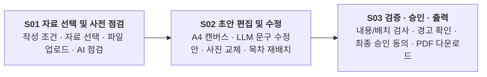

# agent-ddalgi-frontend 개발 작업 내역 종합 보고서

> 2026-09-30 후속: 자동 스탠드얼론/가짜 성공 표시를 해제했다. 아래 과거 오프라인 기능 설명은 현재 서비스 연결 상태를 뜻하지 않는다. 최신 변경과 검증은 문서 마지막 기록을 따른다.

- **작성일자**: 2026-09-30
- **프로젝트**: 회사소개서 초안 생성 AI 어시스턴트 프론트엔드 (`agent-ddalgi-frontend`)
- **저장소 위치**: `agent-ddalgi-frontend-develop`
- **적용 규격**: 백엔드 루트 `contracts.md` v1.11 / 계약 1.5
- **기술 스택**: React 19, TypeScript, Vite 8, TailwindCSS v4, React Router Dom 7, Lucide React, html2canvas, jsPDF, docx, file-saver

---

## 1. 프로젝트 개요

본 프로젝트는 기업용 회사소개서 자동 생성 AI 파이프라인의 프론트엔드 시스템입니다. 사용자가 제공하는 회사 기본 정보 및 각종 원천 자료(문서, 발표자료, 이미지 등)를 기반으로 AI가 사전 점검을 수행하고, 초안 문서를 생성하며, 텍스트 및 사진 후보를 사용자가 직접 비교·편집한 후, 엄격한 내용 검증(Fact Checking)을 거쳐 인쇄 품질의 고해상도 PDF로 최종 승인·다운로드할 수 있는 3단계 엔터프라이즈 위저드 워크플로우를 제공합니다.



---

## 2. 작업 타임라인 및 마일스톤

### 1단계: 초기 세팅 및 마이그레이션 & 기초 검증 (2026-09-18 이전 ~ 09-18)
- **React + TS + Vite 초기 세팅 (`0aa130b`)**: 최신 React 19와 TypeScript, Vite 환경 구축.
- **기존 프론트엔드 마이그레이션 (`a0bc035`, PR #1)**: 이전 레거시 구조에서 신규 아키텍처로 컴포넌트 및 타입 정의 이관.
- **Mock 데이터 렌더링 13/13 검증 (`4a795cc`, PR #2)**:
  - `fixtures/mock_job_ready.json` 및 `mock_job_error.json` 기반 SSR 렌더링 검사 스크립트(`docs/검증스크립트/render_check.tsx`) 구축.
  - 14개 항목 라벨, 4가지 상태 배지, 본문 13개 섹션 순서/내용, 11개 확인 질문, 출처/인용문 일치 완벽 검증.
- **폴링·다운로드 네트워크 격리 검토**:
  - 중복 클릭 방지, 지수 백오프 폴링, 오류 응답 파일 저장 차단 등 안정성 코드 추적 및 잠재 위험 분석.
- **문서화**: `docs/B_프론트엔드_작업기록_0918.md`, `docs/B_프론트엔드_일일요약_0918.md`, `docs/B_프론트엔드_검증기록_0918.md` 작성.

### 2단계: 3단계 엔터프라이즈 위저드 & 고해상도 PDF 출력 구현 (2026-09-28, PR #4, PR #5)
- **3-Step Wizard 인터페이스 확립 (`a1f7205`)**:
  - 상단 고정 글로벌 헤더(56px), 진행 단계 인디케이터(`StepIndicator`), 상태 알림 모달(`SystemStatusModal`) 구현.
- **안정적인 PDF 출력 파이프라인 구축 (`75ae9ee`, `b781368`, `40d4008`)**:
  - 브라우저 네이티브 PDF 다운로드 연동 및 한글 폰트 렌더링 깨짐 방지 (`canvas-to-pdf`).
  - 고해상도 이미지 및 캡션 임베딩 지원.
- **목차(TOC) 및 에디터 인터랙션 고도화 (`fc0f7f8`, `f8f5e71`, `eafb30d`)**:
  - 목차 드래그 앤 드롭 및 원클릭 순서 재배치 구현.
  - 목차 선택 시 중앙 A4 캔버스와 우측 AI 사이드카 동적 연동.
  - 승인 화면의 카드 그리드 뷰 및 단일 페이지 뷰 모드 지원.

### 3단계: 화면설계도 v1.0 적용 & 백엔드 실제 계약(contracts 1.5) 연동 (2026-09-29, PR #6)
백엔드 계약 v1.11 / 계약 1.5에 맞추어 실제 API를 전면 연동하고 화면설계도를 반영하였습니다.

- **S01 자료 선택·사전 점검 연동**:
  - `src/api/sources.ts`, `src/hooks/useSources.ts`, `SourceSelectionView.tsx`.
  - 작성 조건 설정(회사명, 독자, 목적, 분량), 자료 카드 선택(시연/실제 자료 구분).
  - 파일 업로드 지원(TXT, MD, PDF, DOCX, PPTX, JPG, PNG / 파일당 10MB, 세션당 최대 10개).
  - AI 사전 점검 연동 (`PrecheckPanel.tsx`): 사실·근거 구간·보완 사항·추천 분량 표시 및 확인 체크 게이트.
- **S02 초안 편집 & LLM 문구 수정안(`proposals`) 연동**:
  - `src/api/publication.ts`, `src/hooks/usePublication.ts`, `DocumentWorkspace.tsx`.
  - 선택한 텍스트 블록 1개에 대해 `POST /documents/{did}/proposals` 호출.
  - 원문 vs AI 제안 vs 추천 이유 비교 패널(`AiSidecar.tsx`) 제공 ➔ 명시적 `적용(Apply)` 또는 `거부(Reject)`.
  - 빈 페이지 정리 기능: 내용이 없는 빈 페이지만 안전하게 삭제(`delete_page`).
- **S03 승인 및 고해상도 PDF 출력 연동**:
  - `ApprovalExportView.tsx`.
  - 실제 PDF 배치 검사 이미지 미리보기, 내용 검증(Content Review) 결과 표시.
  - Blocker(필수 결함) 수정 강제 및 Warning(권고 경고) 사유 입력 확인.
  - 명시적 최종 승인 동의 후 고해상도 PDF 다운로드 (동일 바이트 재다운로드 보장).

### 4단계: 에디터 레이아웃 개선, 사진 후보 기능 고도화 & 충돌 해결 (2026-09-29 ~ 09-30, PR #8, Merge)
- **사진 후보 편집 및 검증 (`e598d6b`)**:
  - 텍스트 블록 뒤 사진 추가 / 기존 사진 교체 후보(`candidates`) 조회 및 선택 적용.
  - 새 사진 캡션(설명) 필수 입력 및 이미지 무결성 검증.
  - 완료된 사진 후보 창 닫기 및 문서 레이아웃 시각적 튜닝.
- **브랜치 병합 (`cc733de`)**:
  - `develop` 브랜치 병합 중 `ApprovalExportView.tsx` 충돌 해결 완료.

### 5단계: 기업 위저드 S01~S03 고도화 및 Adobe PDF 8쪽 인쇄·다운로드 구현 (2026-09-30, PR #11)
- **Step 1 작성 설정 및 사전 검토 게이트웨이 활성화 (`87ed635`, `c83fba0`)**:
  - `사용 목적`, `강조 내용`, `방향성`, `페이지 수`, `사진 및 도식 비중` 전체 버튼 선택 인터랙션 및 설정 저장 기능 활성화.
  - 사전 점검 확인 체크박스 활성화 및 `초안 생성 시작` 게이트웨이 정상 연동.
- **거산케미칼 공식 실사 사진 매핑 및 에러 방어 (`a460a14`, `d7c4a29`, `bc57e5f`)**:
  - 404 및 CORS 취약 외부 이미지 제거 후 사옥 전경, 스마트 팩토리 클린룸, 증류 설비, 촉매 반응기, 검사 챔버 실사 사진 5종 매핑.
  - `loadBrowserImage`를 `fetch -> Blob -> URL.createObjectURL` 방식으로 전면 개선하여 4페이지 촉매 반응기 사진 미표시 버그 완벽 해결.
- **Adobe PDF 캡션 배지 레이아웃 & 텍스트 넘침 방지 (`1d1a9e4`, `bc57e5f`)**:
  - 회사명 중복 표기 정제 (`거산케미칼`), 텍스트 너비 실시간 측정 기반 동적 캡슐 너비 계산 및 여유 패딩(22px) 적용.
  - 수직 센터링(`middle`) 및 도형 기반 Canvas 클리핑 마스크(`ctx.clip()`) 이중 적용으로 텍스트 넘침 원천 차단.
- **Adobe Acrobat 규격 8쪽 고해상도 PDF 다운로드 및 인쇄 지원 (`45589c3`, PR #11)**:
  - 원클릭 Adobe PDF 다운로드 및 브라우저 인쇄(`window.print`) 연동 완료.

---

## 3. 화면별 세부 기능 명세

| 화면 | 주요 컴포넌트 | 담당 기능 및 사용자 흐름 |
| :--- | :--- | :--- |
| **S01<br/>자료 선택 및<br/>사전 점검** | `SourceSelectionView.tsx`<br/>`SessionUploadPanel.tsx`<br/>`PrecheckPanel.tsx` | • **작성 설정**: 회사명, 독자, 목적, 강조 사항, 희망 페이지 수 설정<br/>• **자료 선택**: 등록 자료 및 시연 자료(`DEMO_MODE`) 다중 선택<br/>• **파일 업로드**: 다중 포맷 첨부, 멱등성 요청 키 재시도 복구<br/>• **AI 사전 점검**: 사실/근거 매핑, 보완점, 추천 분량 확인 후 초안 생성 요청 |
| **S02<br/>초안 편집 및<br/>문구/사진 수정** | `DocumentWorkspace.tsx`<br/>`DraftEditorView.tsx`<br/>`AiSidecar.tsx`<br/>`ParagraphEditor.tsx` | • **A4 캔버스 에디터**: 실제 출력 비율 캔버스, 줌 조절, 인라인 텍스트 편집<br/>• **목차(TOC)**: 페이지 순서 드래그 앤 드롭 재배치<br/>• **LLM 문구 제안**: 블록별 AI 문구 수정 요청 및 원문 대조 적용/거절<br/>• **사진 관리**: 텍스트 뒤 사진 추가, 사진 교체 후보 선택 및 캡션 입력<br/>• **빈 페이지 정리**: 내용 없는 페이지 원클릭 안전 삭제 |
| **S03<br/>최종 검증,<br/>승인 및 출력** | `DocumentWorkspace.tsx`<br/>`ApprovalExportView.tsx` | • **미리보기 모드**: 카드 그리드 뷰 및 단일 페이지 뷰 전환<br/>• **내용 검증(Content Review)**: AI 사실 검증 및 누락 조건 지적 확인<br/>• **경고 관리**: 필수 문제(Blocker) 차단, 권고 경고(Warning) 자연어 사유 입력 및 확인<br/>• **최종 승인 및 다운로드**: 모든 경고 확인 후 최종 승인 동의 및 고해상도 PDF 다운로드 |

---

## 4. 핵심 아키텍처 및 안전 설계 원칙

1. **상태 분리 및 브라우저 스토리지 최소화**:
   - `localStorage`에는 세션 ID, 작업 ID, 문서 버전, 요청 키 해시만 보관합니다.
   - **원문 문서, 업로드 사진, AI 생성 본문, 최종 승인 동의 정보는 브라우저 스토리지에 영구 저장하지 않습니다.** 새로고침 시 백엔드 API를 통해 서버 정본으로부터 안전하게 복원합니다.
2. **멱등성 및 네트워크 유실 복구**:
   - 업로드, AI 점검/초안 생성, 문구 수정안, 저장 요청 시 고유한 `request_key`를 발급합니다.
   - 네트워크 단절이나 응답 유실 시 동일한 키로 재시도하여 중복 결제 및 중복 생성을 원천 차단합니다.
3. **엄격한 승인 및 검증 게이트**:
   - 미저장 편집 내용이 존재하는 경우 최종 승인 및 PDF 출력이 엄격히 차단됩니다.
   - 본문 편집 및 저장 시 기존에 통과했던 내용 검증, PDF 배치 검사, 승인은 즉시 무효화되어 재검증을 요구합니다.
   - 필수 문제(Blocker)는 사용자가 사유를 입력하더라도 통과할 수 없습니다.

---

## 5. 자동화 검증 스크립트 및 시험 결과

- **`node scripts/check-sources.mjs`**:
  - 자료 선택, 파일 업로드/읽기, 멱등 재시도, 버전 충돌, 세션 복원 등 브라우저 E2E 검증 통과.
- **`node scripts/check-ai-workflow.mjs` (Mock 모드)**:
  - 14~19개 검사 묶음(선택 자료 후보, 응답 유실 복구, 추가/교체/설명 저장, 텍스트/버전 충돌, 실제 승인/PDF 동일 바이트 재다운로드) 전 항목 통과.
- **실제 LLM 유료 파이프라인 완주 (`--publication --proposal --review-replay`)**:
  - 프롬프트 전송 JSON 구조 최적화를 통해 10,000자 초과 방지 (11,306자 ➔ 9,653자 경량화).
  - 실제 LLM 점검 1회 + 초안 생성 1회 + 문구 수정안 1회 + 내용 검증 1회 ➔ 경고 확인 ➔ 고해상도 PDF 렌더링 ➔ 최종 다운로드 완주 확인 (한글 회사명, 납기 조건 등이 반영된 4쪽/2쪽 실제 PDF 산출 확인).

---

## 6. 주요 파일 및 디렉토리 구조

```
src/
├── App.tsx                     # 전역 헤더, 3단계 스텝 네비게이션, 상태 모니터
├── main.tsx                    # 애플리케이션 엔트리포인트
├── index.css                   # TailwindCSS v4 디자인 시스템 토큰
├── api/
│   ├── client.ts               # Axios 기본 인스턴스 (Same-Origin)
│   ├── sources.ts              # S01 자료 목록, 업로드, 선택 API
│   ├── aiWorkflow.ts           # S01 AI 사전 점검 및 초안 생성 작업 API
│   ├── publication.ts          # S02/S03 문서 저장, 수정안, 검증, 승인, PDF API
│   └── sessions.ts             # 세션 수명주기 및 상태 관리 API
├── components/session/
│   ├── StepIndicator.tsx       # 상단 3단계 위저드 진행 표시줄
│   ├── SourceSelectionView.tsx # [S01] 자료 선택 및 작성 조건 화면
│   ├── PrecheckPanel.tsx       # [S01] AI 사전 점검 및 추천 분량 패널
│   ├── SessionUploadPanel.tsx  # [S01] 다중 파일 첨부 패널
│   ├── DocumentWorkspace.tsx   # [S02/S03] 워크스페이스 컨테이너 (화면 전환/상태 보존)
│   ├── DraftEditorView.tsx     # [S02] A4 캔버스 에디터 & 목차(TOC) 트리
│   ├── AiSidecar.tsx           # [S02] AI 문구 수정안 대조/적용 & 원문 근거 패널
│   ├── ParagraphEditor.tsx     # [S02] 인라인 블록 텍스트 에디터
│   ├── ApprovalExportView.tsx  # [S03] 최종 내용 검증, 경고 확인, 승인 및 PDF 출력
│   ├── DocumentExportBar.tsx   # [S03] 하단 액션 독 (승인 / 다운로드)
│   └── SystemStatusModal.tsx   # 예외 상태 및 시스템 모니터링 팝업
docs/
├── 프론트엔드_작업내역_종합정리.md # (상세 보고서) 전체 작업 히스토리 및 명세
├── B_프론트엔드_작업기록_0918.md
├── B_프론트엔드_일일요약_0918.md
└── B_프론트엔드_검증기록_0918.md
scripts/
├── check-sources.mjs           # S01 자료 선택 브라우저 자동화 검증
└── check-ai-workflow.mjs       # S02/S03 워크플로우 및 PDF E2E 검증
```


## 2026-09-30 후속: 자동 가짜 데이터 표시 해제

- 요청: 실제 거산 자료와 서버 등록 시연 자료로 실행하며 프론트 가짜 자료 6개의 자동 표시를 해제한다.
- 유입: `e48663b`(오프라인 스탠드얼론 지원), PR #11의 병합 `cfcd779`(2026-09-30 16:19 KST). 최초 방문에 저장 세션이 없어도 fallback 세션/자료를 만들던 경로였다.
- 변경: `useSources`·`useAiWorkflow`·`usePublication`에서 서버 조회/요청 실패를 가짜 자료·점검·초안·수정안·검증/승인·PDF 성공으로 대체하지 않는다. 기존 API의 응답 유실 재시도 키, 입력 버전 및 명시적 확인 검사를 복구했다. 저장 실패 때 편집 내용은 유지한다.
- 화면: `SourceSelectionView`를 실제 `DocumentWorkspace`와 연결하고 웹 사진 고정 카탈로그를 해제했다. `App`·`AiWorkflowPanel`에서 초안 전 단계 이동 및 확인 없는 생성을 차단했다. 예시 컴포넌트/모듈은 보존하되 활성 흐름에서 사용하지 않는다. 기존 사진 경고 확인·캡션/alt 동기화·문제 근거 표시를 보존했다.
- 빌드 보완: 보존한 `mockBackend.ts`의 예시 페이지 4개에 누락된 `layout_key` 타입 필드를 추가했다. 첫 빌드는 이 기존 누락으로 실패했고 수정 후 통과했다.
- 실제 확인: `npm run build`(TypeScript + Vite) 통과. 변경 TS/TSX 7개에 ESLint 통과. `git diff --check` 통과. Node에서 TypeScript 훅을 메모리로 실행하는 API 대역 검사 9건 통과: 최초 방문 빈 상태, 세션 실패, 선택 저장 실패, 분석 실패, 명시 확인/입력 버전 및 초안 실패, 출력 화면 조회 실패, 내용/배치 검사 실패, 저장 실패의 편집 보존. 브라우저 UI 전체 테스트 대신 훅 실행 결과이며 실제 AI 품질 검증으로 간주하지 않는다.
- 화면 확인: 초기 방문 가짜 자료 0개와 생성 전 2/3단계 비활성, 별도 검증 탭에서 실제 백엔드 작업 시작 후 등록 자료 21개(거산 제공 7개 + 시연 14개) 조회 확인. 등록 DB 내용은 수정하지 않았고 확인용 빈 세션만 생성했다. 원문/비밀값은 저장소에 추가하지 않았다.
- 한계·다음 확인: 실제 LLM 과금 호출, S02/S03 전체 사용자 흐름 및 PDF 재출력은 미실행. 백엔드 계약/DB/Agent 작업 상태는 변경하지 않았다. 후속은 실제 모델·편집·출력 통합 확인이다. 원격 push는 수행하지 않는다.


## 2026-10-01 실제 서버 연결 복구와 가짜 결과 제거

- 실행 중인 develop에는 8994544의 차단 수정이 없어 첫 접속 때 고정 예시6개가 자동 표시됐다. 기존 `codex/disable-auto-mock` 수정을 실제 실행 경로에 적용하고 develop PR로 공유한다.
- 예시 자료·점검·초안·고정 웹 사진 데이터를 서비스 모듈에서 제거했다. 첫 접속/실패는 가짜 세션·성공을 만들지 않으며 이전 가짜 세션 ID도 복원하지 않는다. 생성/승인/출력은 실제 서버 결과를 사용한다.
- 작업 시작 시 서버 정규화 작성 조건을 그대로 적용하고, 상단의 부정확한 자동 저장 안내도 수정했다. 기존 사용자 자료/문서·백엔드 AI 정책은 변경하지 않았다.
- 검증: TypeScript·Vite 빌드, 수정 파일 ESLint, 실패 경로 등을 포함한 메모리 훅 검사9건 통과. 별도 VM 배열 비교 검사의 초기 실패는 직렬화 비교로 수정했다. 실제 프론트에서 서버 작업 생성과 등록21자료 표시 확인. 새 유료 API 호출0회.


## 2026-10-06 DOCX 출력 선택·검사·승인·다운로드 연결

- 백엔드 test 계약1.9/template_v7의 LibreOffice DOCX 출력과 실제 활성 DocumentWorkspace를 연결했다. 출력 API·usePublication·화면 3개 파일과 기존 브라우저 검사 스크립트를 수정했다. 기존 .claude/ 변경은 포함하지 않는다.
- PDF/DOCX 선택에 맞는 배치 검사·미리보기·필수 문제·승인·다운로드를 사용한다. 선택 형식은 복원하되 동의는 복원하지 않는다. 형식 변경도 동의를 해제한다. 다운로드 MIME과 파일 확장자를 검사하고 다른 형식의 검사/승인으로 출력하지 않는다. DOCX가 단일 열 편집 문서이고 LibreOffice 미리보기와 Word의 쪽 나눔이 다를 수 있음을 안내한다.
- 백엔드에서 열린 표준 입력 상속으로 LibreOffice 변환이 멈추던 문제와 문서 전체 쪽수 불일치(null page_id)가 문서 조회500으로 바뀌던 문제를 수정했다. 넘침/쪽수 불일치는 읽을 수 있는 실패 결과이며 승인은 차단된다. 상세 서버 기록은 C:/backend/task_backend.md의 docx-ui-20261006을 따른다.
- 최종 TypeScript/Vite 빌드·변경 TS/TSX 3개 ESLint·변경 코드/스크립트 Prettier·git diff --check 통과. 실제 Chrome/HTTP UI 검사 `node scripts/check-ai-workflow.mjs --publication --docx --photos` 및 `--publication --photos` 모두 PASS. 임시 v11 DB와 가상 회사/사진·mock Agent이며 유료 모델 호출0회다.
- 사진 두 장의 과도한 표지는 실제5쪽/failed와 승인 차단을 확인했다. 편집으로 기존 사진을 명시적으로 제거한 뒤 사진1장을 보존한 DOCX4쪽39,025바이트/PDF4쪽26,968바이트를 검사·승인·다운로드했다. 재다운로드 바이트 동일, 형식 변경/새로고침 동의 해제, 잘못된 MIME 응답 거부 후 재시도, 편집 후 이전 다운로드409, 종료 정리를 확인했다. 페이지별 미리보기·좁은 화면·모바일 스크린샷 확인. 실제 회사의 DOCX 배치·전체 품질 검수는 후속이다.
- 백엔드와 프론트는 별도 저장소다. 프론트 현재 develop의 명시적 변경 파일만 커밋하고 원격 push는 하지 않는다. 기존 사용자 자료와 백엔드 모델/프롬프트는 수정하지 않았다.

## 2026-10-06 — pull 병합 및 백엔드 연결 검토 수정

- 기존 b0f58ac + c1088d0 병합의 충돌을 해결했다. C-05 자료 변경 복귀, 업로드/저장 응답 유실 복구, 명시적 preview 격리를 보존했다.
- 서버에 등록되지 않은 가상 공개 자료 자동 추가를 제거했다. DART/KIPRIS/G2B 자동 수집은 미연결로 표시하며 실제 자료를 첨부하도록 안내한다. 파일명으로 내용 충족을 단정하는 표시도 제거했다.
- 회사 변경 모달은 화면 표시 이름 변경임을 명시한다. 백엔드 문서나 공개 자료가 갱신된다고 안내하지 않는다.
- PDF/DOCX 전환 시 이전 exportId/approvalId를 해제하고 다운로드 버튼과 실행 조건을 일치시켰다. 서버가 받지 않는 PHOTO_CONTENT_REVIEW 확인 처리를 제거했다.
- 개발 크롤러는 사설 IP/DNS/리다이렉트 차단, 검증한 IP 고정, TLS 검증, 응답 크기·시간·이미지 MIME 제한을 적용했다. 수집 실패를 가짜 회사 사진으로 채우지 않는다. 현재 WebPhotoCollector는 주 화면에 연결되지 않으며 운영 수집 서버·수집 사진의 백엔드 등록은 구현 완료 범위가 아니다.
- 검증: build 및 수정 TS 파일 ESLint 통과. scripts/check-ai-workflow.mjs --publication --photos --impact --docx 통과(C-05, 응답 유실 복구, 4쪽 DOCX 52,542바이트, 양쪽 형식 승인 뒤 전환/원래 DOCX 재사용). --screen-preview의 3단계/편집/새로고침/API 미호출/저장소 격리 통과. --review-regressions-only는 크롤러 IP/DNS/redirect/TLS/MIME/크기 제한과 가짜 fallback 부재 통과.
- 브라우저 검사는 임시 DB·가상 자료·mock AI를 사용했다. 실제 회사 자료·유료 모델·시연 DB·환경 파일을 수정하지 않았다. 백엔드의 내용/배치 검사 중복 요청 수정은 별도 test 브랜치에서 BE-06 96건을 통과했다. 실제 외부 사이트 수집이나 일반 AI 품질 전체를 검증한 결과는 아니다.
- 이 기록 이후의 현재 동작은 위 기준을 따른다. 앞선 공개 자료 자동 수집/SSL 우회/가짜 fallback 관련 설명은 현재 기능 설명으로 사용하지 않는다.

## 2026-10-06 — 프론트 화면 기준 회사 선택·충족도 연결

- 사용자 지시에 따라 직전 기록의 '화면 표시 이름 변경으로 축소/공개 자료·충족도 UI 제거' 방식을 대체했다. 회사 변경 모달·공개 자료 가져오기 버튼·충족도 막대를 유지하고 실제 서버 응답에 연결했다.
- 회사 선택은 기존 Brief.target_company를 사용한다. 작업 전 선택은 세션 생성에 포함되고, 작업 중 변경은 서버에 회사명과 빈 자료 선택을 함께 저장한다. 파일과 기존 문서는 보존하며 새로고침 후 복원된다. 문서가 있으면 기존 C-05 자료 변경 시작이 선행한다. 헤더와 자료 영역은 같은 모달/저장 동작을 사용한다.
- 회사 변경 실패 시 완료로 표시하지 않고 재시도한다. 같은 시도는 멱등 키를 재사용한다. 회사명은 자료 추출의 대상 식별 단서이며 사실 근거를 생성하지 않는다.
- 충족도는 Preflight.sufficiency의 4개 분야 근거 포함 비율(각 25점)을 표시한다. 파일명 추정은 사용하지 않는다. 확인 필요·충돌·열린 blocker를 구별하며 저장 전 조건 변경/입력 revision 변경 시 이전 결과를 표시하지 않는다. 100%도 승인 완료를 뜻하지 않는다.
- 공개 자료 POST /sessions/{sid}/public-data/import를 연결했다. 현재 API 키와 수집기가 없어 503 PUBLIC_DATA_NOT_CONFIGURED를 표시한다. 샘플 자료/Job/성공 상태를 만들지 않는다. 실제 DART/KIPRIS/G2B 수집기는 후속이며 키 입력만으로 활성화되지는 않는다.
- 검증: --publication --photos --impact --docx의 30개 검사 묶음 PASS. 회사 선택/변경/자료 선택 해제/파일 보존/새로고침, 키 미설정 무변경, 실제 점검 충족도/입력 변경 후 숨김, 기존 C-05/응답 유실/편집/4쪽 DOCX 승인 및 동일 파일 다운로드/형식 전환을 확인했다. --screen-preview도 API 호출 없이 PASS. 최종 빌드와 수정 TS 파일 ESLint를 확인했다.
- 계약은 백엔드 contracts.md 문서 v1.33/계약1.9 호환 확장이다. 별도 프론트 계약 사본 파일은 없으며 src/api/sources.ts와 aiWorkflow.ts에 타입을 반영했다. 외부 유료 API/실회사 데이터는 회귀 검사에 사용하지 않았다.


## 2026-10-07 — 초안 생성 실패 후 같은 화면에서 복구

초안 생성이 실패하면 '초안 생성 실패'를 표시하고 확인 체크를 해제합니다. 서버가 retry_draft로 안내하거나 기존 재시도 가능한 오류를 반환한 경우 점검 내용을 다시 확인한 뒤 '확인한 자료로 초안 다시 생성'을 누를 수 있습니다. 완료한 자료 점검은 유지되며 새로운 시도에 새 멱등 키를 사용합니다. 같은 요청의 응답 유실은 기존 키로 복구합니다. 입력 변경·취소·저장 문서가 있는 경우 이전 점검으로 재생성하지 않습니다.

검증: TypeScript/Vite 빌드와 수정 TS ESLint 통과. AI_CHECK_BACKEND=C:/final/backend node scripts/check-ai-workflow.mjs --draft-recovery --publication --photos --impact --docx에서 격리 mock 브라우저 30개 검사 묶음 PASS. 실패 후 새로고침 복원, 확인 초기화, 새 키 재시도, 점검 추가 호출 없음과 기존 C-05·사진·4쪽 DOCX 승인/다운로드를 확인했습니다. 실제 AI 품질 전체를 검증한 결과는 아닙니다. 서버 계약1.9/DB v11을 유지하며 실제 시연 DB·.env는 바꾸지 않았습니다.


### 초안 진입 조건 대조 (2026-10-07)

원래 fix/draft-generation-recovery에 최신 develop(ad853a1)을 병합해 자료 복원 화면과 초안 재시도를 함께 유지했습니다. 사진만 선택하면 AI 점검을 요청하지 않고, can_generate=false의 실제 회사명/필수·제외/확정 근거 사유를 표시합니다. 서버의 선택적 latest_preflight_id를 사용해 같은 입력의 새 점검을 GET만으로 복구하며 확인은 다시 받습니다. 입력 revision이 다른 충돌에서는 이전 점검/확인을 버리고 자료 상태 새로고침을 안내합니다. 진행 중 시도는 임의로 다른 점검에 연결하지 않습니다. 재시도 가능한 초안 실패는 같은 점검/새 키/명시 확인으로 재시도하고 자료 문제·취소·저장 문서는 자동 재시도하지 않습니다. API 계약1.9 호환 확장, 백엔드 계약 원본은 contracts.md v1.37이며 새 프론트 계약 사본은 만들지 않았습니다.

격리 mock 브라우저에서 PDF27개 검사 묶음과 최종 DOCX33개 묶음이 통과했습니다. 초안 진입4종/사진만 선택/실제 오래된 점검 POST409 이후 최신 점검 GET 복원/확인 재설정/초안만 재시도/C-05/사진/승인·다운로드를 확인했습니다. 실제 AI 품질 반복 평가와 실자료 유료 재생성은 수행하지 않았고 시연 DB/.env는 수정하지 않았습니다. 최종 TypeScript/Vite 빌드와 수정 TS ESLint·스크립트 문법을 확인했습니다.


## 2026-10-07 — 점검 항목 제외·복원과 자료 보완

사전 점검의 선택 항목은 서버가 허용한 fact ID만 '이 항목 제외'로 처리하고 '항목 복원'으로 원래 근거 상태를 되살립니다. 새 불변 점검 ID를 저장하며 사용자 확인은 초기화합니다. 화면 새로고침과 응답 유실 후 같은 요청 키 재전송을 지원하고 추가 AI 추출을 호출하지 않습니다. 회사명·필수 정보·마지막 사업 설명은 제외할 수 없습니다. 사실/문제의 자료 보완은 첨부 선택으로 연결하며 기존 문서의 미저장 편집은 보호합니다. 검증의 EVIDENCE_INVALID도 근거 확인 화면으로 돌아갈 수 있습니다.

최신 develop의 filename 기반 가짜 사실/인용 추가와 서버 문제/초안 가능 여부 덮어쓰기, 공개 연동 실패 시 가상 자료 fallback, 서버 선택 거부 후 로컬 성공 표시를 제거했습니다. 실제 서버의 사실/문제/충족도/자료 선택/연동 상태를 표시합니다. 업로드 자동 선택은 서버 저장 성공 때만 안내합니다.

검증: TypeScript/Vite 빌드·전체 ESLint 통과. 격리 mock 브라우저 --draft-entry --draft-recovery --publication --photos --impact의31개 묶음 통과. 제외·복원/응답 유실 재전송/확인 초기화/추출 호출 증가 없음/초안 재시도/C-05/사진/편집충돌/PDF검사·승인·동일 바이트 다운로드/종료를 확인했습니다. API1.9 호환 확장, 백엔드 계약 원본v1.42/DBv11/template_v11. 실제 시연 데이터/원문/.env와 기존 문서는 자동 변경하지 않았으며 유료 AI 반복 평가·추가 DOCX 검사는 미실행입니다. 근거 누락이나 틀린 주체는 실제 자료 보완 또는 문구 수정이 필요합니다.


## 2026-10-07 — 검증 문제의 수정 위치·근거 확인과 조회 불일치 복구

서버 IssueOut의 fact_ids/source_ids를 프론트 타입과 위치 연결에 반영했습니다. 실제 block_ids 위치가 있으면 우선 표시하고, 없을 때만 같은 사실/자료를 사용하는 관련 블록을 보여 줍니다. 관련 위치는 AI가 직접 지적한 문구와 구분합니다. 충돌·수치·조건·인증·근거 없는 주장 및 preflight 문제에서 근거 점검으로 돌아갈 수 있습니다. 배치/이미 해결된 문제에는 이 버튼을 표시하지 않으며 blocker를 확인 클릭으로 해결하지 않습니다.

문서/문제 GET 사이에 revision 또는 validation ID가 바뀌면 두 GET을 한 번만 재조회합니다. 계속 불일치하면 기존 문서/편집을 보존하고 오류를 표시하며 AI/문서 변경을 자동 요청하지 않습니다.

검증: TypeScript/Vite 빌드·전체 및 수정 파일 ESLint·JS 문법·diff 검사 통과. 격리 mock 브라우저 --draft-entry --draft-recovery --publication --photos --impact의33개 묶음 PASS·4쪽 PDF27,755바이트. 가상 오류7종, 관련/직접 위치와 직접 위치 우선, 사라진 블록의 관련 근거, 전체 문서 문제의 근거 이동, layout/해결 항목 버튼 제외, 필수 차단 유지, 일시 불일치 GET 재조회 및 지속 불일치 중단, 추가 AI/문서 변경 없음과 기존 C-05·사진·검증·승인·다운로드를 확인했습니다. 통합 검사는 비동기 복원/조회 완료를 기다린 뒤 다음 클릭을 수행합니다.

조사한 시연 DB는 활성 세션0개이며 이전 사실·문구는 종료/만료 후 정리되어 현재 실자료 미해결을 개별 판정한 결과가 아닙니다. 실제 원문/키/DB·유료 AI를 변경하지 않았습니다. API1.9/백엔드 계약문서v1.42/DBv11 유지. 다음 실자료 검수와 실제 AI 반복 측정은 남아 있습니다.


## 2026-10-07 — 사용 목적 목록 수정의 브랜치 누락 복구

이전 수정899be14는 fix/draft-generation-recovery에만 있었고 현재 fix/preflight-review-actions에는 포함되지 않았습니다. 현재 작업본의 기본 datalist가 입력된 문구로 후보를 필터링해 다시 전체 내용을 지워야 했습니다. 현재 브랜치에 직접 입력 가능한 combobox와 전체 목록 버튼을 반영했습니다. 기존/맞춤 문구를 유지한 상태에서 네 목적을 모두 표시하고 선택값과 도움말을 갱신합니다. 방향키/Enter·Escape·외부 클릭/포커스 이동을 지원하며 기존 작성 설정 잠금은 유지합니다. API/저장 형식은 그대로입니다.

검증: TypeScript/Vite 빌드·수정 파일 ESLint·스크립트 문법·diff 검사 통과. 격리 mock 브라우저에서 기존/맞춤 문구 상태의 전체4항목 표시·문구 유지·마우스/키보드 선택·Escape/외부 클릭 닫힘과 기존 점검/응답 유실 복구/항목 제외·복원/초안 생성·복원/세션 정리가 PASS였습니다. Chrome 화면도 확인했습니다. 실행 중인 localhost:5173의 소스 응답200에 새 목록 컨트롤이 있으며 datalist는 없습니다. 처음 가상 화면 시연 검사에서는 기존 초안의 설정 잠금으로 목적 입력이 비활성화돼 시험을 중단했고, 설정이 활성화된 새 작업 검사로 확인했습니다. 시연 DB/.env·다른 브랜치·.claude는 변경하지 않았습니다. 실제 AI0회; 예정된 새 실자료 검수보다 사용자가 지적한 화면 복구를 우선했으며 실자료 검수는 아직 미실행입니다.

## 2026-10-07 DART 실제 연결·기업명 빠른 선택

- 회사 변경 입력300ms 후 GET /api/v1/companies로 실제 기업을 검색한다. 정식/접두/부분 이름 최대20개, 결과없음/키오류/검색중 표시와 이전요청취소를 적용했다. 네이버는 공식 DART 이름 NAVER를 우선 보여준다. 정식 이름과 선택된 dart_corp_code를 함께 저장하고 직접 수정 시 고유번호를 해제한다. 예시 회사 카드는 제거했다.
- DART public-data 상태와 import202 Job을 연결하고 요청키/Job ID를 재접속 때 보존한다. PUBLIC_OPEN_DATA로 공개 탭의 개수/목록을 통일하여 등록된 자료가 탭에서 빠지던 결함을 고쳤다. 실제 등록자료를 사용자가 선택해 점검하며 자동 AI 호출은 하지 않는다. 특허청·나라장터는 미연결이다.
- 백엔드 contracts.md 문서v1.38/계약1.9와 타입·경로·202응답·Brief 선택 필드를 맞췄다. 프론트 계약사본 파일은 현재 없으며 복사 완료로 표시하지 않는다. 회사 변경의 선택해제/파일보존·C-05 유지.
- TypeScript/Vite build·전체ESLint PASS. 실제Chrome: 삼성전자 수집2자료/완료/선택저장, 미등록거산0자료, 네이버검색17결과/첫NAVER00266961/저장·최신검색·결과없음·수동입력code해제, 모두0AI호출 PASS. 각 새시험세션만 종료정리했다.
- 최종 격리mock UI27묶음 PASS·4쪽PDF26,968바이트(ddalgi-ai-ui-BINx81). 이전사용목적목록전체선택 수정899be14와 함께 기존작업브랜치에 보존한다. 원격푸시/병합은이번단위에서수행하지않는다.
